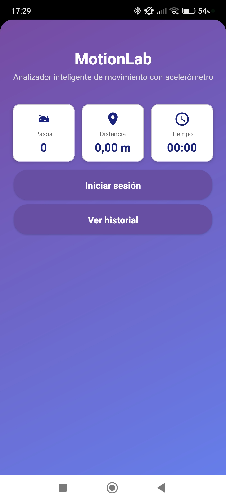
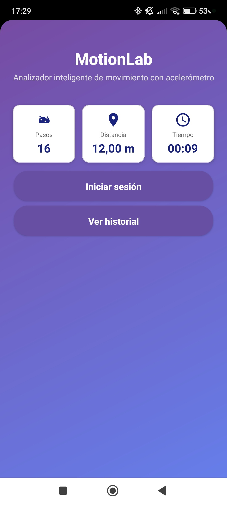
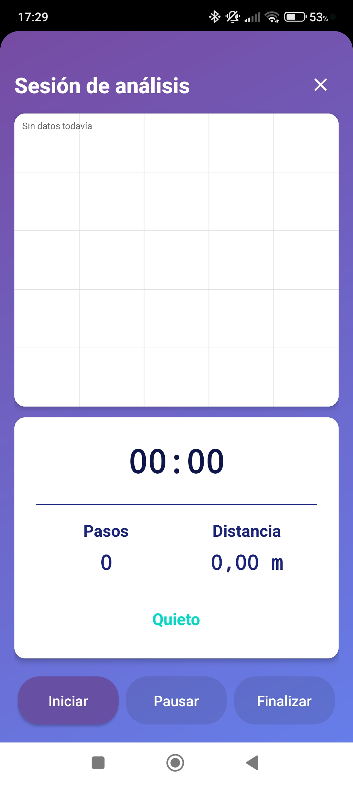
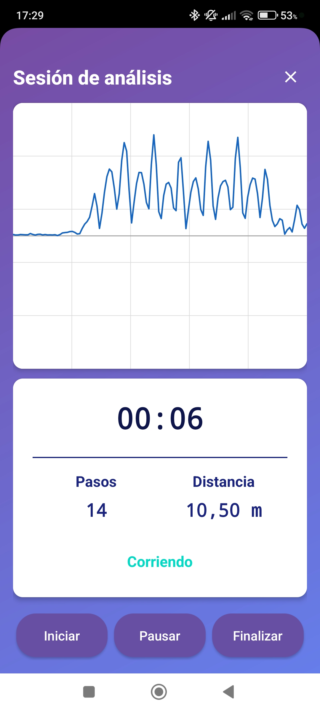
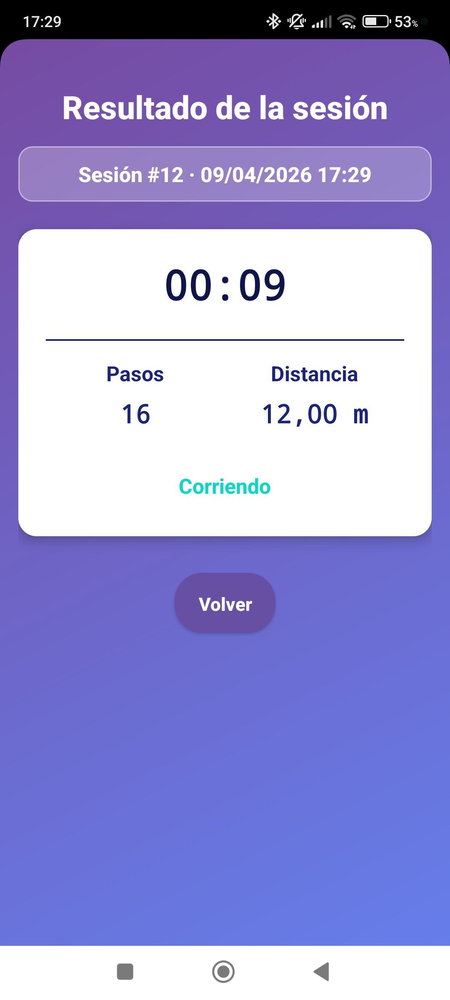
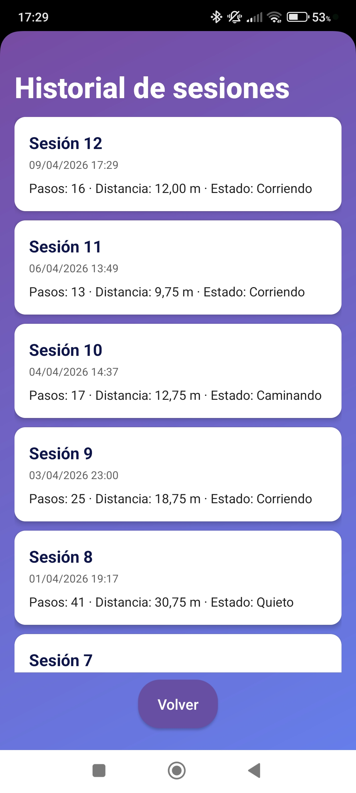

# MotionLab

## Intelligent Movement Analyzer

<div align="center">
  
  <a href="README.es.md">
    
  </a>
  
  <br>
  <sub>*Click the button above to read in Spanish*</sub>

</div>

---

[](https://developer.android.com)
[](https://www.java.com/)
[](LICENSE)

---

## Description

**MotionLab** is an Android application developed in **Java 11** that analyzes the user's physical movement using the device's built-in accelerometer sensor. The app captures real-time data from the `TYPE_ACCELEROMETER` sensor and applies signal processing techniques to interpret physical behavior.

The system can **detect steps**, **estimate distance traveled**, and **classify movement state** (Quiet, Walking, or Running) by analyzing the magnitude of the acceleration vector.

The main goal is not just to use the sensor, but to **understand its physical behavior** and apply basic mathematical processing to raw data.

## Key Features

- ✅ Real-time accelerometer data capture
- ✅ Low-pass filter to remove gravity component
- ✅ Step detection via peak detection algorithm
- ✅ Movement classification (Quiet / Walking / Running)
- ✅ Distance estimation based on step count and configurable step length
- ✅ Real-time graph visualization using **Custom View + Canvas**
- ✅ Session persistence with **SQLite / Room**
- ✅ Shared `StatsFragment` used across multiple Activities
- ✅ Proper sensor lifecycle management (`onResume` / `onPause`)

## Screens & Workflow

### 1. Main Screen (`MainActivity`)

| Screen | Preview |
|--------|---------|
| Main Screen (initial) |  |
| Main Screen (with daily stats) |  |

### 2. Session Screen (`MotionActivity`)

| Screen | Preview |
|--------|---------|
| Session Screen (empty / not started) |  |
| Session Screen (active monitoring) |  |

### 3. Results Screen (`ResultActivity`)

| Screen | Preview |
|--------|---------|
| Results Screen |  |

### 4. History Screen (`HistoryActivity`)

| Screen | Preview |
|--------|---------|
| History Screen |  |

## Data Persistence

When a session ends, all data is automatically saved to a local **SQLite** database (via **Room**). The history screen loads these records to display past sessions. The main screen can also show daily statistics.

## Technologies Used

| Category | Technologies |
|----------|--------------|
| Platform | Android Studio, Java 11, Android SDK |
| Sensors | SensorManager, SensorEventListener, TYPE_ACCELEROMETER, SENSOR_DELAY_GAME |
| Processing | Low-pass filter, vector magnitude calculation, peak detection |
| Graphics | Custom View, Canvas, Paint, `invalidate()` |
| Architecture | Multiple Activities, Shared Fragment (StatsFragment) |
| Persistence | SQLite / Room |

## Requirements

- Android Studio Ladybug or newer
- Android SDK (minimum API level: 24 / Android 7.0)
- A physical Android device with an accelerometer (emulator may not provide realistic sensor data)

## Installation

```bash
git clone https://github.com/yourusername/motionlab.git
cd motionlab
# Open the project in Android Studio
# Build and run on a physical device
